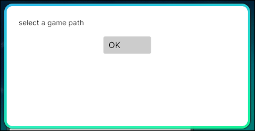

# ווינדוס

כאשר ממודדים את Gorilla Tag בווינדוס, יש לך שתי אפשרויות עיקריות:

---

## אפשרות 1: Monke Mod Manager (MMM)
### קושי: קל

MMM היא הדרך הפשוטה ביותר להתקנת מודים.

#### שלב 1: הורדה
[הורד את Monke Mod Manager](https://github.com/arielthemonke/MonkeModManager/releases/latest/download/MonkeModManager.exe)

#### שלב 2: הפעלת MMM
זה אמור להיראות כך:  

- לחץ על אוקיי והזן את מיקום המשחק שלך
- לא יודע מה מיקום המשחק? [לחץ כאן למדריך](game-path.md)

#### שלב 3: התקנת מודים
- לחץ על **Install** ליד המודים שברצונך להתקין.
- מאוד פשוט וקל

#### שלב 4: התקנת מודים שלא נמצאים במונקי מוד מאנאג'ר
מודים שאינם כלולים ב-MMM יכולים להיות מותקנים ידנית:

1. קח את קובץ ה-`.dll` של המוד.  
2. העבר אותו לתיקיית `plugins` שנמצאת ב: `(מיקום המשחק שלך)\BepInEx\plugins`

---

## אפשרות 2: התקנה ידנית של בפינאקס
### קושי: בינוני

אפשרות זו דורשת יותר שלבים, טובה אם רוצים ללמוד או אם אנטי-וירוס חוסם את MMM.

#### שלב 1: הורדת בפינאקס
הורד את הגרסה האחרונה של `BepInEx_win_x64_*.zip` מ-[כאן](https://github.com/BepInEx/BepInEx/releases/latest)

#### שלב 2: חילוץ
- חלץ את תוכן הקובץ לתיקיית המשחק של Gorilla Tag.  
- כעת התיקייה שלך צריכה להכיל את `BepInEx`, `doorstop_config.ini`, וכו'.

#### שלב 3: תיקון קונפיג והתקנת מודים
1. **תיקון הקונפיג**  
- הורד את [קובץ הקונפיג הזה ל-BepInEx](https://github.com/The-Graze/MonkeModInfo/blob/master/BepInEx.cfg)  
- העבר אותו ל: `(מיקום המשחק שלך)\BepInEx\config`
- *צור את תיקיית `config` אם אינה קיימת.*

#### שלב 5: התקנת מודים
- קח את קובץ ה-`.dll` של המוד.  
- העבר אותו לתיקיית `plugins` הנמצאת ב-: `(מיקום המשחק שלך)\BepInEx\plugins`
- *צור את תיקיית `plugins` אם אינה קיימת.*

---

[דף הבא >](the-end.md)
