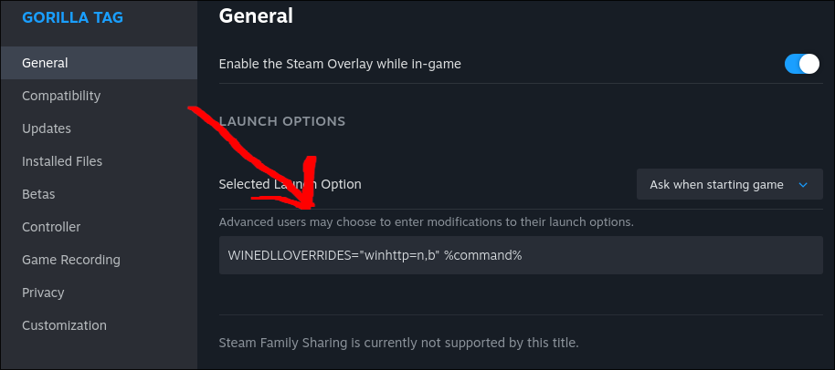

# Linux

When modding Gorilla Tag on Linux, you have two main options:

---

## Option 1: Monke Mod Manager (MMM)
### Difficulty: Easy

MMM is the simplest way to install mods.

#### Step 1: Download
[Download Monke Mod Manager](https://github.com/arielthemonke/MonkeModManager/releases/latest/download/MonkeModManager.Linux)

#### Step 2: Launch MMM
It should look omething like this:  


- Click **OK** and enter your **Gorilla Tag game path**.  
- Don’t know your game path? [Click here for a guide](game-path.md)

#### Step 3: Install Mods
- Click **Install** next to the mods you want.  
- MMM handles the rest — very straightforward and super easy

#### Step 4: Set Launch Options (Steam)
- In your Steam library, right-click **Gorilla Tag** > **Properties** > **Launch Options** and paste:
```
WINEDLLOVERRIDES="winhttp=n,b" %command%
```

- Close the window.

#### Step 5: Installing Custom Mods (Optional)
Mods not included in MMM can be installed manually:

1. Grab the mod `.dll` file.  
2. Move it to your `plugins` folder at: `(your game path)\BepInEx\plugins`

---

## Option 2: Manual BepInEx Install
### Difficulty: Medium

This option requires more steps, its good if you want to learn I guess

#### Step 1: Download BepInEx
Get the latest `BepInEx_win_x64_*.zip` from [BepInEx Releases](https://github.com/BepInEx/BepInEx/releases/latest)

**Yes, even on linux, we still download the windows version**


#### Step 2: Extract
- Extract the zip contents into your Gorilla Tag game path.  
- Your folder should now contain `BepInEx`, `doorstop_config.ini`, etc.

#### Step 3: Configure & Install Mods
1. **Fixing Config**  
- Download [this BepInEx config file](https://github.com/The-Graze/MonkeModInfo/blob/master/BepInEx.cfg)  
- Move it to:  
  ```
  (your game path)\BepInEx\config
  ```
- *Create the `config` folder if it doesn’t exist.*

2. **Installing Mods**  
- Grab the mod `.dll` file.  
- Move it to your `plugins` folder at:  
  ```
  (your game path)\BepInEx\plugins
  ```
- *Create the `plugins` folder if it doesn’t exist.*

#### Step 4: Set Launch Options (Steam)
- In your Steam library, right-click **Gorilla Tag** > **Properties** > **Launch Options** and paste:
```
WINEDLLOVERRIDES="winhttp=n,b" %command%
```

- Close the window.

---

[next page >](the-end.md)
